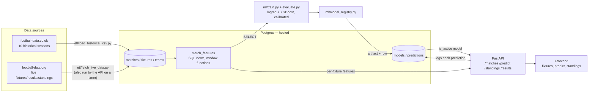

# PredictXI

[](https://github.com/KarimgitCS/PredictXI/actions/workflows/tests.yml)

**[Live demo](https://predictxi-w7ki.onrender.com)** — hosted on Render's
free tier (see "Deployment" below). The app pings itself to stay awake; if it
ever does sleep, the first request wakes it and retrains the model (~10–20s),
then it's normal speed.

Premier League match outcome predictor (Home / Draw / Away) with calibrated
probabilities, comparing logistic regression against XGBoost. Feature
engineering happens entirely in Postgres via leakage-safe SQL views; the API
serves whatever the active model predicts, and the frontend lets you make
and track your own predictions against the model's.

Portfolio project — see [PLAN.md](PLAN.md) for the full step-by-step build
log, including two real performance/concurrency bugs found and fixed while
actually running the app (not just from tests).


## What it does

- **Fixtures page** — Home/Draw/Away probabilities for the upcoming
  matchweek (not just a single pick), plus the most likely score, each
  team's recent form, and its current league position.
- **Predict page** — make your own call on each upcoming match. Picks are
  saved in your browser and graded against the real results once matches are
  played, grouped by matchweek with a right–wrong record (e.g. 5–4) that
  expands to the individual picks.
- **Standings page** — the current league table.
- **Two models, one served** — logistic regression and XGBoost are trained on
  identical, leakage-safe features with a chronological split (never a random
  shuffle), calibrated, and compared on a held-out season; the API serves the
  one with the better log loss.
- **Stays current on its own** — while running, the API pulls finished
  matches, fixtures and standings from football-data.org in the background.

## By the numbers

- **10 seasons** of historical data (2010–11 → 2019–20): **3,800 matches**
  loaded, plus the current season's results and fixtures (refreshed
  automatically) across **41 teams**.
- **Held out on the 2019–20 season** (380 matches, never seen during
  training or calibration): accuracy 53.16% (logreg) / 51.58% (XGBoost);
  Brier score 0.6101 / 0.6103; log loss 1.0341 / 1.0243 — XGBoost wins on
  log loss (the proper scoring rule for calibrated probabilities) and is
  the model the API actually serves. Full numbers, methodology, and the
  per-class calibration curves: [reports/model_comparison.md](reports/model_comparison.md),
  generated by [ml/evaluate.py](ml/evaluate.py).
- **API latency**, measured end-to-end against the live hosted Postgres
  instance (30 requests each, warm process):

  | Endpoint | p50 | p95 |
  |---|---|---|
  | `/health` (DB round-trip only) | 121ms | 152ms |
  | `/matches` | 123ms | 126ms |
  | `/predict?fixture_id=...` | 199ms | 204ms |

  Most of this is the network round-trip to a hosted Postgres instance, not
  model inference — the DB isn't colocated with the API, by design (see
  PLAN.md's hosting decision).

## Architecture



The one rule every SQL view in `match_features` follows: a feature may only
use matches strictly *before* the match being predicted. See
[db/migrations/008_match_features_views.sql](db/migrations/008_match_features_views.sql)
for how that's enforced.

## Tech stack

Postgres (hosted — Neon or Supabase) · Python (pandas, scikit-learn, XGBoost)
· FastAPI · plain HTML/CSS/JS · Docker · GitHub Actions

## Setup

### 1. Database

Create a free-tier Postgres instance (Neon or Supabase) and get its
connection string. Copy `.env.example` to `.env` and fill in
`DATABASE_URL` and (optionally, for live-data updates)
`FOOTBALL_DATA_ORG_API_KEY` (free key from
[football-data.org](https://www.football-data.org/client/register)).

### 2. Environment

```bash
python3 -m venv .venv
source .venv/bin/activate
pip install -r requirements.txt
```

On macOS, XGBoost also needs the OpenMP runtime: `brew install libomp`.

### 3. Schema, data, and models

```bash
python db/migrate.py                  # creates all tables + views

python etl/download_historical_csv.py  # 10 seasons of match data
python etl/load_historical_csv.py      # loads them into Postgres

python etl/fetch_live_data.py          # current-season fixtures + standings

python ml/model_registry.py            # trains, evaluates, and activates a model
```

### 4. Run it

**Docker** (serves the API and the frontend together on one port):

```bash
docker compose up api
```

**Or directly:**

```bash
uvicorn api.main:app --reload
```

Either way, visit **http://localhost:8000/** for the full demo (Fixtures,
Predict and Standings pages). The raw API
is also there: `/matches`, `/predict?fixture_id=...`, `/standings`,
`/results?season=...`, `/health`.

While it runs, the API refreshes live data by itself (on startup, then every
30 minutes — `LIVE_REFRESH_MINUTES`, `0` to disable; needs
`FOOTBALL_DATA_ORG_API_KEY`): finished matches move into `matches`, upcoming
fixtures and standings update, and the Predict page's saved picks pick up
the new results. No need to re-run `etl/fetch_live_data.py` by hand.

The frontend calls the API on its own origin, so it works wherever the
backend serves it. If you host the frontend somewhere else (e.g. GitHub
Pages), set `API_BASE` in [frontend/config.js](frontend/config.js) to the
backend's full URL.

## Deployment (Render)

The API is a single Docker container — [api/Dockerfile](api/Dockerfile) — that
serves both the FastAPI backend and the static frontend, and the database is
already hosted (Neon/Supabase), so it needs nowhere to run except somewhere
that can run that one container. On startup, [api/entrypoint.sh](api/entrypoint.sh)
trains a fresh model against whatever's already in the hosted DB and
registers it active before serving — no model files are baked into the
image or committed to the repo (see the comment in `.gitignore`), so this
works the same on a laptop, in `docker compose`, or on a brand-new container
that's never seen this codebase before.

1. **Create a free Render account** at [render.com](https://render.com) (GitHub
   sign-in is easiest, since the next step connects your repo anyway).
2. **New → Web Service**, connect the `PredictXI` GitHub repo (Render can
   access private repos once you authorize it during sign-in).
3. Render should auto-detect the Dockerfile; if it asks for a path, point it
   at `api/Dockerfile` with build context `.` (the repo root — the Dockerfile
   `COPY`s from `ml/`, `etl/`, `api/`, `frontend/` relative to root).
4. **Environment** tab → add `DATABASE_URL` (same connection string as your
   local `.env` — use the provider's *session pooler* string) and, to enable
   the automatic live-data refresh, `FOOTBALL_DATA_ORG_API_KEY`. Don't set
   `PORT` — Render supplies its own and `entrypoint.sh` reads it.
5. Pick the **Free** instance type and click **Create Web Service**. First
   build takes a few minutes (installing pandas/scikit-learn/XGBoost);
   Render gives you a `https://<name>.onrender.com` URL once it's live.
6. Free-tier services sleep after 15 minutes without traffic, and waking one
   re-runs the training step above (a slow first request). To avoid that, on
   Render the API pings its own `/health` every 10 minutes
   (`KEEP_ALIVE_MINUTES`, `0` to disable), which keeps the service awake, the
   live-data refresh running, and the hosted database from pausing. One
   always-on free service uses about 744 of the 750 free instance hours per
   month, so this fits for a single service per Render workspace.

## Tests

```bash
pytest etl/tests/ ml/tests/ db/tests/ api/tests/
```

Runs against the same hosted database as everything else in this
project (see PLAN.md's API-backend note on why — no isolated test schema was
built). Test-inserted rows clean up after themselves.

**CI** ([.github/workflows/tests.yml](.github/workflows/tests.yml)) runs
`ml/tests/`, `db/tests/`, `api/tests/`, and `etl/tests/test_fetch_live_data.py`
on every push — deliberately excluding
`etl/tests/test_load_historical_csv.py`, whose idempotency check re-runs the
full ~10-minute historical loader; run that one manually after touching the
historical ETL code. To make CI pass, add `DATABASE_URL` as a repository
secret: **Settings → Secrets and variables → Actions → New repository
secret**, name `DATABASE_URL`, value your hosted Postgres connection string
(same one in your local `.env`).

## Known limitations

- **football-data.org's free tier has no shot/corner/foul/card data** —
  only scores, fixtures, and standings. Current-season matches will have
  NULL for those stat columns; rolling-form features degrade toward NULL
  as more of a team's recent history is current-season. XGBoost handles
  this natively; logistic regression imputes.
- **Teams outside the 2010–2020 historical window** (promoted since, or not
  yet backfilled by the live API this preseason) have no rolling form until
  they accumulate tracked matches — shown as NULL, not a fabricated guess.
- **Free-tier hosting sleeps without traffic** unless the self-ping described
  under "Deployment" keeps it awake. If the service is ever stopped or
  restarted, the first request after a wake is slow (it retrains the model)
  and the background refresh only runs while the service is up.
- **Free-tier databases pause after inactivity** (Supabase, Neon) and, on
  some plans, are eventually deleted — the app can't start until the
  database is restored.
- **One database, several environments.** A laptop and a deployed container
  can share one database, and each registers its own model file at its own
  path. The API serves the active model, and if that file isn't on the
  current machine it falls back to the best registered model that is.
- **Predictions you save are per-browser.** They live in `localStorage`, not
  in an account, so they don't follow you to another browser or device.

## License

Portfolio project — no license, all rights reserved by the author.
