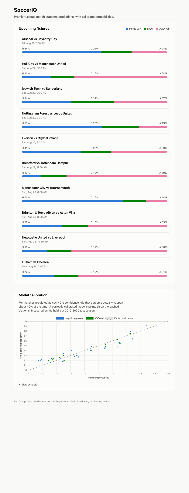
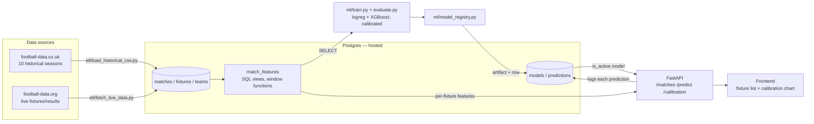

# SoccerIQ

[](https://github.com/KarimgitCS/SoccerIQ/actions/workflows/tests.yml)

Premier League match outcome predictor (Home / Draw / Away) with calibrated
probabilities, comparing logistic regression against XGBoost. Feature
engineering happens entirely in Postgres via leakage-safe SQL views; the API
and frontend serve whatever the active model predicts.

Portfolio project — see [PLAN.md](PLAN.md) for the full phase-by-phase build
log, including two real performance/concurrency bugs found and fixed while
actually running the app (not just from tests).



## What it does

- Predicts Home/Draw/Away for upcoming Premier League fixtures, with a
  probability for each outcome (not just a single pick).
- Trains and compares two models — logistic regression and XGBoost — on
  identical, leakage-safe features, and reports which one is better
  calibrated (not just more accurate).
- Shows a calibration chart: when the model says "40% chance," did that
  outcome happen about 40% of the time?

## Architecture



The one rule every SQL view in `match_features` follows: a feature may only
use matches strictly *before* the match being predicted. See
[db/migrations/008_match_features_views.sql](db/migrations/008_match_features_views.sql)
for how that's enforced.

## Tech stack

Postgres (hosted — Neon or Supabase) · Python (pandas, scikit-learn, XGBoost)
· FastAPI · plain HTML/CSS/JS + Chart.js · Docker

## Setup

### 1. Database

Create a free-tier Postgres instance (Neon or Supabase) and get its
connection string. Copy `.env.example` to `.env` and fill in
`DATABASE_URL` and (optionally, for live-data updates)
`FOOTBALL_DATA_ORG_API_KEY` (free key from
[football-data.org](https://www.football-data.org/client/register)).

### 2. Environment

```bash
python3 -m venv .venv
source .venv/bin/activate
pip install -r requirements.txt
```

On macOS, XGBoost also needs the OpenMP runtime: `brew install libomp`.

### 3. Schema, data, and models

```bash
python db/migrate.py                  # creates all tables + views

python etl/download_historical_csv.py  # 10 seasons of match data
python etl/load_historical_csv.py      # loads them into Postgres

python etl/fetch_live_data.py          # current-season fixtures + standings

python ml/model_registry.py            # trains, evaluates, and activates a model
```

### 4. Run it

**Docker** (serves the API and the frontend together on one port):

```bash
docker compose up api
```

**Or directly:**

```bash
uvicorn api.main:app --reload
```

Either way, visit **http://localhost:8000/** for the full demo — the fixture
list and calibration chart. The raw API is also there: `/matches`,
`/predict?fixture_id=...`, `/calibration`, `/health`.

## Tests

```bash
pytest etl/tests/ ml/tests/ db/tests/ api/tests/
```

Runs against the same hosted database as everything else in this
project (see PLAN.md's Phase 7 note on why — no isolated test schema was
built). Test-inserted rows clean up after themselves.

**CI** ([.github/workflows/tests.yml](.github/workflows/tests.yml)) runs
`ml/tests/`, `db/tests/`, `api/tests/`, and `etl/tests/test_fetch_live_data.py`
on every push — deliberately excluding
`etl/tests/test_load_historical_csv.py`, whose idempotency check re-runs the
full ~10-minute historical loader; run that one manually after touching the
historical ETL code. To make CI pass, add `DATABASE_URL` as a repository
secret: **Settings → Secrets and variables → Actions → New repository
secret**, name `DATABASE_URL`, value your hosted Postgres connection string
(same one in your local `.env`).

## Known limitations

- **football-data.org's free tier has no shot/corner/foul/card data** —
  only scores, fixtures, and standings. Current-season matches will have
  NULL for those stat columns; rolling-form features degrade toward NULL
  as more of a team's recent history is current-season. XGBoost handles
  this natively; logistic regression imputes.
- **Teams outside the 2010–2020 historical window** (promoted since, or not
  yet backfilled by the live API this preseason) have no rolling form until
  they accumulate tracked matches — shown as NULL, not a fabricated guess.
- **Local-only**: no cloud deployment, by design (see PLAN.md's Context).

## License

Portfolio project — no license, all rights reserved by the author.
